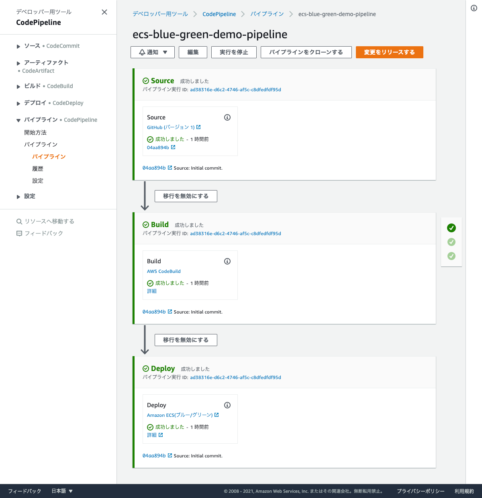
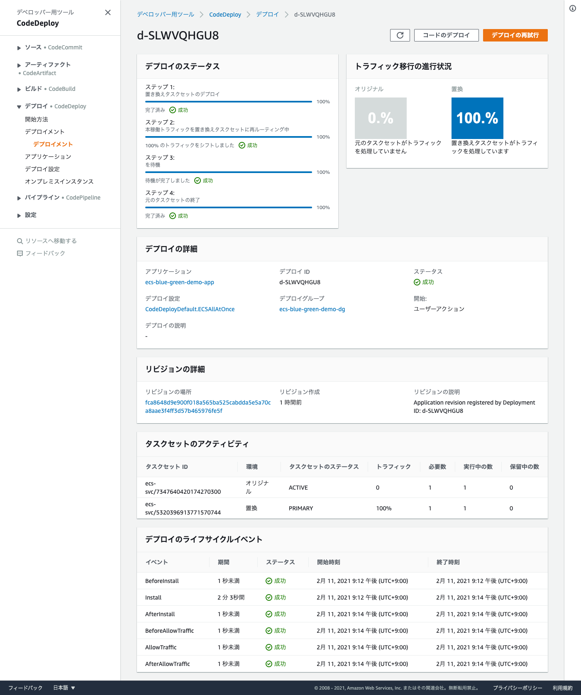

# ecs-blue-green-demo
This repository provides `AWS CloudFormation` templates for `AWS ECS` with Blue/Green Deployment.

## Set up environment and deploy application
The Makefile is provided, so, you can set up the environment by executing the make command.  
See the Makefile for command details.

### Create VPC, Subnet, Network...

```bash
$ make deploy-vpc-subnet profile=$(profile)
$ make deploy-nat-instance profile=$(profile)
$ make deploy-network profile=$(profile)
$ make deploy-security-group profile=$(profile)
$ make deploy-load-balancer profile=$(profile)
```

### Create `ECR` repository and push docker images

```bash
$ make deploy-ecs-ecr profile=$(profile)
$ make push-docker-images profile=$(profile) 
```

### Create `ECS` cluster and service
```bash
$ make deploy-ecs-cluster profile=$(profile)
$ make deploy-ecs-service profile=$(profile)
```

### Register `GitHub` private access token into `Secrets Manager`
```bash
$ make deploy-secrets-github profile=$(profile) access-token=$(access-token)
```

### Register `Docker` username and private access token into `Secrets Manager`
```bash
$ make deploy-secrets-docker profile=$(profile) username=$(username) access-token=$(access-token)
```

### Create CodeDeploy application and deploy group
```bash
$ make deploy-code-deploy profile=$(profile)
```

### Create `CodePipeline`
```bash
$ make deploy-code-pipeline profile=$(profile)
```

## Screenshots




## Confirm the application is running
```bash
$ curl -L -X GET -I 'http://${Load Balancer DNS}' # e.g http://ecs-blue-green-demo-app-xxxxxxxxx.{region}.elb.amazonaws.com
HTTP/1.1 200 OK
Date: Thu, 11 Feb 2021 13:45:13 GMT
Content-Type: text/html; charset=UTF-8
Transfer-Encoding: chunked
Connection: keep-alive
Server: nginx
X-Powered-By: PHP/7.4.15
```
